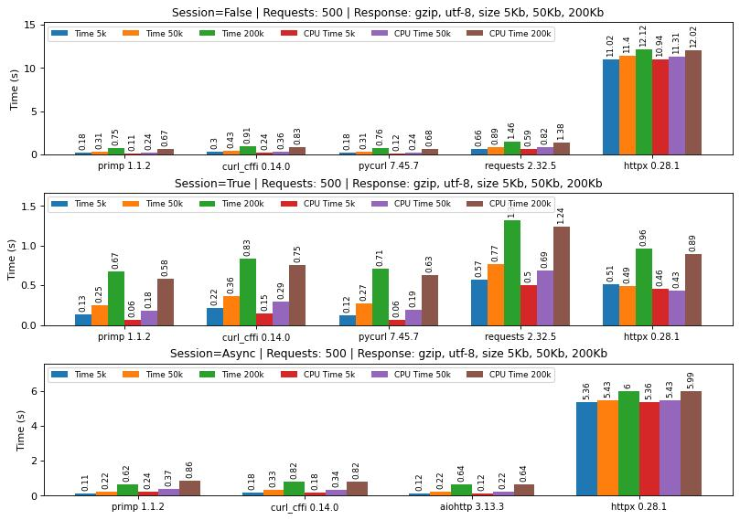

# 🪞 PRIMP 🦀🐍

> HTTP client that can impersonate web browsers.

## 🚀 Quick Start

### Rust

```toml
[dependencies]
primp = { git = "https://github.com/deedy5/primp" }
```

```rust
use primp::Client;

#[tokio::main]
async fn main() -> Result<(), Box<dyn std::error::Error>> {
    let client = Client::builder()
        .impersonate("chrome_145")
        .build()?;
    
    let resp = client.get("https://tls.peet.ws/api/all").send().await?;
    println!("Body: {}", resp.text().await?);
    
    Ok(())
}
```

### Python

```bash
pip install primp
```

```python
import primp

client = primp.Client(impersonate="chrome_145")
resp = client.get("https://tls.peet.ws/api/all")
print(resp.text)
```

## 🎭 Browser Impersonation

<table>
<tr>
<td valign="top">

| Browser | Profiles |
|:--------|:---------|
| 🌐 **Chrome** | `chrome_144`, `chrome_145` |
| 🧭 **Safari** | `safari_18.5`, `safari_26` |
| 🔷 **Edge** | `edge_144`, `edge_145` |
| 🦊 **Firefox** | `firefox_140`, `firefox_146` |
| ⭕ **Opera** | `opera_126`, `opera_127` |
| 🎲 **Random** | `random` |

</td>
<td valign="top">

| OS | Value |
|:---|:------|
| 🤖 Android | `android` |
| 🍎 iOS | `ios` |
| 🐧 Linux | `linux` |
| 🍏 macOS | `macos` |
| 🪟 Windows | `windows` |
| 🎲 Random | `random` |

</td>
</tr>
</table>

## ⚡ Features

- 🔥 **Fast** - Built on hyper and tokio
- 🎭 **Browser Impersonation** - Mimic Chrome, Safari, Firefox, Edge, Opera
- 🌍 **OS Impersonation** - Windows, Linux, macOS, Android, iOS
- 🔄 **Sync & Async** - Both APIs available
- 🍪 **Cookie Management** - Persistent cookie store
- 🌐 **Proxy Support** - HTTP, HTTPS, SOCKS5
- 📤 **Multipart** - Form data and file uploads
- 🔐 **TLS** - rustls backend
- 📦 **Compression** - gzip, brotli, deflate, zstd

## 📊 Benchmark (python binding)



## 📚 Documentation

- 🦀 [Rust library](./crates/primp/README.md)
- 🐍 [Python library](./crates/primp-python/README.md)

## 🔧 Building from Source

```bash
# Clone the repository
git clone https://github.com/deedy5/primp.git && cd primp

# Build primp rust library
cargo build -r -p primp

# Build primp python library
cargo build -r -p primp-python

# Build primp python library using maturin
cd crates/primp-python
python -m venv .venv && source .venv/bin/activate
pip install maturin && maturin develop -r
```

## 🧪 Testing

```bash
# Test primp rust library
cargo test -p primp

# Test primp python library
cargo test -p primp-python

# Test all crates
cargo test --workspace
```

___
## Disclaimer

This tool is for educational purposes only. Use it at your own risk.
