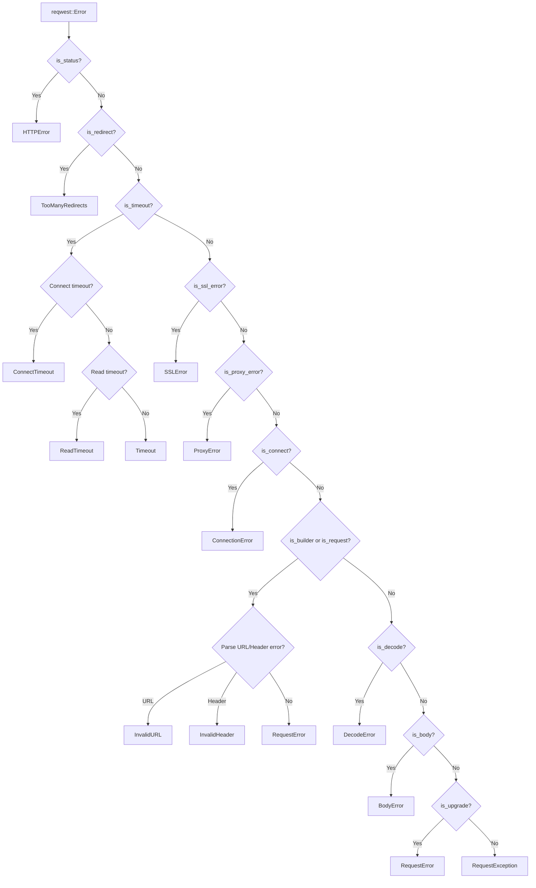

# Exception Simplification Plan

## Executive Summary

This document analyzes the current Python exception hierarchy in primp and proposes a simplified design that better maps to the underlying Rust errors from `primp-reqwest`. The goal is to reduce complexity while maintaining compatibility with the requests-like API.

---

## 1. Current Python Exceptions Inventory

### 1.1 Exception Hierarchy

The current implementation defines **24 exception types** organized in the following hierarchy:

```
RequestException (base class)
├── HTTPError                    # 4xx/5xx status codes
├── ConnectionError              # Connection failures
│   ├── ProxyError              # Proxy-related errors
│   ├── SSLError                # SSL/TLS errors
│   └── ConnectTimeout          # Connection timeout
├── Timeout                      # Generic timeout
│   └── ReadTimeout             # Read timeout
├── TooManyRedirects            # Redirect limit exceeded
├── RequestError                # Request building/sending errors
├── ContentDecodingError        # Response decode errors
├── StreamConsumedError         # Stream already consumed
├── UpgradeError                # Protocol upgrade errors
├── InvalidJSONError            # Invalid JSON in request
│   └── JSONDecodeError         # JSON decode in response
├── URLRequired                 # Missing URL
├── MissingSchema               # Missing URL schema
├── InvalidSchema               # Invalid URL schema
├── InvalidURL                  # Invalid URL format
│   └── InvalidProxyURL         # Invalid proxy URL
├── InvalidHeader               # Invalid HTTP header
├── ChunkedEncodingError        # Chunked encoding errors
├── UnrewindableBodyError       # Body cannot be rewound
└── RetryError                  # Retry exhausted
```

### 1.2 Warnings Hierarchy

```
RequestsWarning (base)
├── FileModeWarning
└── RequestsDependencyWarning
```

### 1.3 Current Detection Methods

The current implementation in [`src/error.rs`](src/error.rs) uses:

1. **Type-based detection** via `reqwest::Error` methods:
   - `is_status()` → HTTPError
   - `is_redirect()` → TooManyRedirects
   - `is_timeout()` → Timeout/ConnectTimeout/ReadTimeout
   - `is_connect()` → ConnectionError
   - `is_builder()` → RequestError
   - `is_request()` → RequestError
   - `is_decode()` → ContentDecodingError
   - `is_body()` → StreamConsumedError
   - `is_upgrade()` → UpgradeError

2. **Source chain inspection** for:
   - SSL errors (keywords: certificate, ssl, tls, handshake, x509, pkix)
   - Proxy errors (keywords: proxy, socks)
   - Connect timeout detection

3. **String-based parsing** for:
   - MissingSchema
   - InvalidSchema
   - InvalidURL
   - InvalidHeader
   - ChunkedEncodingError

---

## 2. Rust Errors That Can Be Propagated

### 2.1 primp-reqwest Error Types

The main error type is defined in [`crates/primp-reqwest/src/error.rs`](crates/primp-reqwest/src/error.rs):

```rust
pub(crate) enum Kind {
    Builder,                              // Request building errors
    Request,                              // Request sending errors
    Redirect,                             // Redirect errors
    Status(StatusCode, Option<ReasonPhrase>), // HTTP status errors
    Body,                                 // Body errors
    Decode,                               // Response decoding errors
    Upgrade,                              // Protocol upgrade errors
}
```

**Detection methods available:**
- `is_builder()` - Builder configuration errors
- `is_request()` - Request transmission errors
- `is_redirect()` - Redirect policy errors
- `is_status()` - HTTP 4xx/5xx status errors
- `is_timeout()` - Timeout via source chain inspection
- `is_connect()` - Connection errors via source chain
- `is_body()` - Body read/write errors
- `is_decode()` - Response decoding errors
- `is_upgrade()` - Protocol upgrade errors

**Internal error types:**
- `TimedOut` - Internal timeout marker
- `BadScheme` - Invalid URL scheme

### 2.2 primp-hyper Error Types

Defined in [`crates/primp-reqwest/crates/primp-hyper/src/error.rs`](crates/primp-reqwest/crates/primp-hyper/src/error.rs):

```rust
pub(super) enum Kind {
    Parse(Parse),           // HTTP parsing errors
    User(User),             // User-caused errors
    IncompleteMessage,      // Connection closed prematurely
    UnexpectedMessage,      // Unexpected protocol message
    Canceled,               // Operation canceled
    ChannelClosed,          // Channel closed
    Io,                     // I/O errors
    HeaderTimeout,          // Header read timeout
    Body,                   // Body errors
    BodyWrite,              // Body write errors
    Shutdown,               // Shutdown errors
    Http2,                  // HTTP/2 errors
}
```

**Detection methods:**
- `is_parse()` - Parse errors
- `is_user()` - User errors
- `is_canceled()` - Cancellation
- `is_closed()` - Channel closed
- `is_incomplete_message()` - Incomplete message
- `is_body_write_aborted()` - Body write aborted
- `is_shutdown()` - Shutdown error
- `is_timeout()` - Timeout detection

### 2.3 primp-h2 Error Types

Defined in [`crates/primp-reqwest/crates/primp-h2/src/error.rs`](crates/primp-reqwest/crates/primp-h2/src/error.rs):

```rust
enum Kind {
    Reset(StreamId, Reason, Initiator),   // RST_STREAM frame
    GoAway(Bytes, Reason, Initiator),     // GO_AWAY frame
    Reason(Reason),                        // Bare reason
    User(UserError),                       // User error
    Io(io::Error),                         // I/O error
}
```

**Detection methods:**
- `reason()` - Get H2 error reason
- `is_io()` - I/O error
- `is_go_away()` - GO_AWAY received
- `is_reset()` - RST_STREAM received
- `is_remote()` - Remote peer error
- `is_library()` - Library-detected error

### 2.4 H2 UserError Types

Defined in [`crates/primp-reqwest/crates/primp-h2/src/codec/error.rs`](crates/primp-reqwest/crates/primp-h2/src/codec/error.rs):

```rust
pub enum UserError {
    InactiveStreamId,
    UnexpectedFrameType,
    PayloadTooBig,
    Rejected,
    ReleaseCapacityTooBig,
    OverflowedStreamId,
    MalformedHeaders,
    MissingUriSchemeAndAuthority,
    PollResetAfterSendResponse,
    SendPingWhilePending,
    SendSettingsWhilePending,
    PeerDisabledServerPush,
    InvalidInformationalStatusCode,
}
```

### 2.5 SOCKS Proxy Errors

Defined in [`crates/primp-reqwest/src/connect.rs`](crates/primp-reqwest/src/connect.rs):

```rust
pub(super) enum SocksProxyError {
    SocksNoHostInUrl,
    SocksLocalResolve(BoxError),
    SocksConnect(BoxError),
}
```

---

## 3. Proposed Simplified Exception Hierarchy

### 3.1 Design Principles

1. **Map directly to Rust error types** where possible
2. **Remove redundant exceptions** that don't provide actionable distinction
3. **Use error message parsing** only when type-based detection is unavailable
4. **Maintain backward compatibility** with requests-like API
5. **Keep the hierarchy shallow** for easier error handling

### 3.2 Proposed Hierarchy

```
RequestException (base class)
├── HTTPError                    # HTTP 4xx/5xx status codes
│   └── status_code, reason, url attributes
├── ConnectionError              # All connection-related failures
│   ├── SSLError                # SSL/TLS certificate errors
│   └── ProxyError              # Proxy connection errors
├── Timeout                      # All timeout-related failures
│   ├── ConnectTimeout          # Connection establishment timeout
│   └── ReadTimeout             # Data read timeout
├── RequestError                 # Request building/sending errors
│   ├── InvalidURL              # URL format errors
│   └── InvalidHeader           # Header format errors
├── BodyError                    # Body-related errors (NEW)
│   ├── StreamConsumedError     # Stream already consumed
│   └── ChunkedEncodingError    # Chunked encoding errors
├── DecodeError                  # Decoding errors (NEW)
│   └── ContentDecodingError    # Content decode errors
├── JSONError                    # JSON-related errors (NEW)
│   ├── InvalidJSONError        # Invalid JSON in request
│   └── JSONDecodeError         # JSON decode in response
└── TooManyRedirects            # Redirect limit exceeded
```

### 3.3 Exceptions to Remove

| Exception | Reason | Replacement |
|-----------|--------|-------------|
| `URLRequired` | Never raised in practice | `RequestError` |
| `MissingSchema` | String-based detection unreliable | `InvalidURL` |
| `InvalidSchema` | String-based detection unreliable | `InvalidURL` |
| `InvalidProxyURL` | Redundant with ProxyError | `ProxyError` |
| `UnrewindableBodyError` | Rarely used | `BodyError` |
| `RetryError` | Not implemented in core | Remove or keep for future |
| `UpgradeError` | Rarely used | `RequestError` |

### 3.4 Exceptions to Merge

| Current | New Parent | Notes |
|---------|------------|-------|
| `StreamConsumedError` | `BodyError` | More specific body error |
| `ChunkedEncodingError` | `BodyError` | More specific body error |
| `ContentDecodingError` | `DecodeError` | Broader decode category |
| `InvalidJSONError` | `JSONError` | Group JSON errors together |

---

## 4. Error Mapping from Rust to Python

### 4.1 Primary Mapping Table

| Rust Error Type | Detection Method | Python Exception |
|-----------------|------------------|------------------|
| `Kind::Status` | `is_status()` | `HTTPError` |
| `Kind::Redirect` | `is_redirect()` | `TooManyRedirects` |
| `Kind::Builder` | `is_builder()` | `RequestError` or `InvalidURL`/`InvalidHeader` |
| `Kind::Request` | `is_request()` | `RequestError` |
| `Kind::Body` | `is_body()` | `BodyError` or `StreamConsumedError` |
| `Kind::Decode` | `is_decode()` | `DecodeError` or `ContentDecodingError` |
| `Kind::Upgrade` | `is_upgrade()` | `RequestError` |
| Timeout (source chain) | `is_timeout()` | `Timeout`/`ConnectTimeout`/`ReadTimeout` |
| SSL (source chain) | Keyword detection | `SSLError` |
| Proxy (source chain) | Keyword detection | `ProxyError` |
| Connect (source chain) | `is_connect()` | `ConnectionError` |

### 4.2 Detection Flow



### 4.3 Enhanced Detection Strategies

#### SSL Error Detection

Current approach uses keyword matching. Proposed enhancement:

```rust
fn is_ssl_error(err: &reqwest::Error) -> bool {
    error_chain_matches(err, |e| {
        // Check for rustls error types
        e.downcast_ref::<rustls::Error>().is_some() ||
        // Check for native-tls error types
        e.downcast_ref::<native_tls::Error>().is_some() ||
        // Fallback to keyword matching
        error_chain_contains_keywords(e, &["certificate", "ssl", "tls", "handshake"])
    })
}
```

#### Proxy Error Detection

```rust
fn is_proxy_error(err: &reqwest::Error) -> bool {
    error_chain_matches(err, |e| {
        // Check for SOCKS proxy errors
        e.downcast_ref::<SocksProxyError>().is_some() ||
        // Fallback to keyword matching
        error_chain_contains_keywords(e, &["proxy", "socks"])
    })
}
```

---

## 5. Implementation Recommendations

### 5.1 Phase 1: Restructure Exception Hierarchy

1. **Create new base exceptions:**
   - `BodyError` as subclass of `RequestException`
   - `DecodeError` as subclass of `RequestException`
   - `JSONError` as subclass of `RequestException`

2. **Reparent existing exceptions:**
   - Move `StreamConsumedError` under `BodyError`
   - Move `ChunkedEncodingError` under `BodyError`
   - Move `ContentDecodingError` under `DecodeError`
   - Move `InvalidJSONError` and `JSONDecodeError` under `JSONError`

3. **Deprecate old exceptions:**
   - Mark `URLRequired`, `MissingSchema`, `InvalidSchema`, `InvalidProxyURL` as deprecated
   - Map them to new exceptions with deprecation warnings

### 5.2 Phase 2: Improve Error Detection

1. **Add type-based detection for SSL errors:**
   - Check for `rustls::Error` in source chain
   - Check for `native_tls::Error` in source chain

2. **Add type-based detection for proxy errors:**
   - Check for `SocksProxyError` in source chain

3. **Improve timeout detection:**
   - Better distinguish between connect and read timeouts
   - Use hyper timeout types when available

### 5.3 Phase 3: Add Error Context

1. **Enhance exception attributes:**
   ```python
   class RequestException(Exception):
       url: str | None
       method: str | None      # NEW
       timeout: float | None   # NEW

   class HTTPError(RequestException):
       status_code: int
       reason: str | None
       response: Response | None  # NEW
   ```

2. **Add `__str__` improvements:**
   - Include relevant context in error messages
   - Provide actionable suggestions where possible

### 5.4 Code Changes Required

#### src/error.rs

```rust
// Add new exception types
create_exception!(primp, BodyError, RequestException);
create_exception!(primp, DecodeError, RequestException);
create_exception!(primp, JSONError, RequestException);

// Reparent existing exceptions
create_exception!(primp, StreamConsumedError, BodyError);
create_exception!(primp, ChunkedEncodingError, BodyError);
create_exception!(primp, ContentDecodingError, DecodeError);
create_exception!(primp, InvalidJSONError, JSONError);
create_exception!(primp, JSONDecodeError, JSONError);

// Update convert_reqwest_error function
pub fn convert_reqwest_error(err: reqwest::Error, context: Option<&ErrorContext>) -> PyErr {
    // ... existing logic ...
    
    // Add body error handling
    if err.is_body() {
        if is_chunked_encoding_error(&message) {
            return ChunkedEncodingError::new_err((message, url));
        }
        return BodyError::new_err((message, url));
    }
    
    // Add decode error handling
    if err.is_decode() {
        return ContentDecodingError::new_err((message, url));
    }
    
    // ...
}
```

#### primp/primp.pyi

Update the type stubs to reflect the new hierarchy.

---

## 6. Migration Guide

### 6.1 For Users

Most users will not need to change their code. The following changes are backward compatible:

```python
# Still works - catches all body errors
except primp.StreamConsumedError:
    pass

# Also works now - catches all body errors including StreamConsumedError
except primp.BodyError:
    pass
```

### 6.2 For Library Maintainers

If catching specific exceptions:

```python
# Old code
except primp.MissingSchema as e:
    handle_missing_schema(e)

# New code
except primp.InvalidURL as e:
    handle_invalid_url(e)  # MissingSchema now raises InvalidURL
```

---

## 7. Summary

### Current State
- 24 exception types
- Mixed type-based and string-based detection
- Some redundant exceptions
- Hierarchy doesn't always match Rust error structure

### Proposed State
- 18 exception types (6 removed/merged)
- Primarily type-based detection
- Clear mapping from Rust errors
- Better organized hierarchy

### Benefits
1. **Simpler API** - Fewer exceptions to learn
2. **Better error handling** - Clear hierarchy for catching
3. **More reliable** - Type-based detection over string parsing
4. **Maintainable** - Direct mapping from Rust errors
